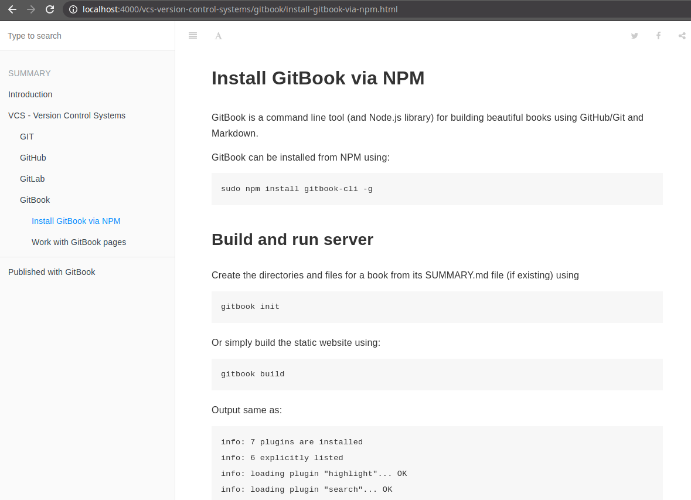

# Example using GitBook

This example uses the NPM [GitBook](https://www.npmjs.com/package/gitbook) package

---

Install GitBook from NPM:
~~~
sudo npm install gitbook-cli -g
~~~

## Build

Create the directories and files for a book:
~~~
gitbook build
~~~

Output same as:
~~~
info: 7 plugins are installed 
info: 6 explicitly listed 
info: loading plugin "highlight"... OK 
info: loading plugin "search"... OK 
info: loading plugin "lunr"... OK 
info: loading plugin "sharing"... OK 
info: loading plugin "fontsettings"... OK 
info: loading plugin "theme-default"... OK 
info: found 3 pages 
info: found 6 asset files 
info: >> generation finished with success in 0.8s ! 
~~~

In the project we get the following structure is of the book:

## Run

You can serve a repository as a book using:
~~~
gitbook serve
~~~

Output same as:
~~~
Live reload server started on port: 35729
Press CTRL+C to quit ...

info: 7 plugins are installed 
info: loading plugin "livereload"... OK 
info: loading plugin "highlight"... OK 
info: loading plugin "search"... OK 
info: loading plugin "lunr"... OK 
info: loading plugin "sharing"... OK 
info: loading plugin "fontsettings"... OK 
info: loading plugin "theme-default"... OK 
info: found 3 pages 
info: found 6 asset files 
info: >> generation finished with success in 0.9s ! 

Starting server ...
Serving book on http://localhost:4000
~~~

---
In the browser:

## Possible problems

Error:
~~~
internal/streams/readable.js:649
  if (state.pipes.length === 1) {
            ^

TypeError: Cannot read property 'pipes' of undefined
    at ReadStream.Readable.pipe (internal/streams/readable.js:649:13)
    at /home/amber/.gitbook/versions/3.2.3/node_modules/cpr/lib/index.js:163:22
    at callback (/usr/lib/node_modules/gitbook-cli/node_modules/npm/node_modules/graceful-fs/polyfills.js:299:20)
    at FSReqCallback.oncomplete (fs.js:183:21)
~~~
or
~~~
internal/streams/readable.js:649
  if (state.pipes.length === 1) {
            ^

TypeError: Cannot read property 'pipes' of undefined
    at ReadStream.Readable.pipe (internal/streams/readable.js:649:13)
    at /home/amber/.gitbook/versions/3.2.3/node_modules/cpr/lib/index.js:163:22
    at /home/amber/.gitbook/versions/3.2.3/node_modules/cpr/node_modules/graceful-fs/polyfills.js:282:31
    at callback (/usr/lib/node_modules/gitbook-cli/node_modules/npm/node_modules/graceful-fs/polyfills.js:299:20)
    at FSReqCallback.oncomplete (fs.js:183:21)

~~~

## Solution

Change the `graceful-fs` package

`cd /usr/lib/node_modules/gitbook-cli/node_modules/npm/node_modules`

Run command:
~~~
sudo npm install graceful-fs@latest --save
~~~

or
~~~
sudo npm install graceful-fs@4.2.0 --save
~~~

---
Links:

[https://stackoverflow.com](https://stackoverflow.com/a/64211387/2617791)

[https://github.com/GitbookIO/gitbook-cli/issues/113](https://github.com/GitbookIO/gitbook-cli/issues/113#issuecomment-751989328)

---
See also: [Brief information about using GitBook](https://til.secretgeek.net/gitbook/01_summary.html)